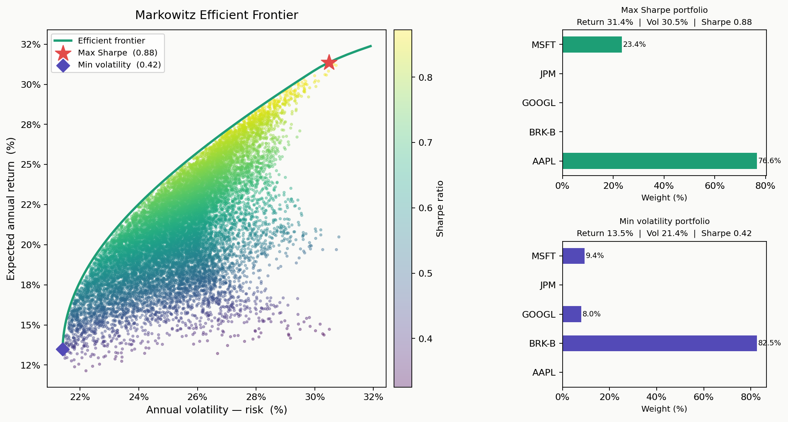

# Portfolio Optimizer — Markowitz Mean-Variance Optimization

Finds the optimal stock allocation that maximizes risk-adjusted return, using Modern Portfolio Theory.



## What it does

- Downloads real historical price data for any set of tickers (Yahoo Finance)
- Finds the **maximum Sharpe ratio** portfolio via constrained optimization (scipy SLSQP)
- Finds the **minimum volatility** portfolio
- Traces the full efficient frontier and plots the risk-return space across 15,000 simulated portfolios

## Run it

```bash
pip install numpy pandas scipy matplotlib yfinance
python portfolio_optimizer.py
```

Custom tickers:

```bash
python portfolio_optimizer.py --tickers AAPL NVDA TSLA META --start 2020-01-01
```

## Key formulas

```
Portfolio return:    E[Rp] = wᵀ · μ
Portfolio variance:  σ²p   = wᵀ · Σ · w
Sharpe ratio:        S     = (E[Rp] − Rf) / σp
```

## Stack
Python · NumPy · SciPy · pandas · Matplotlib · yfinance
